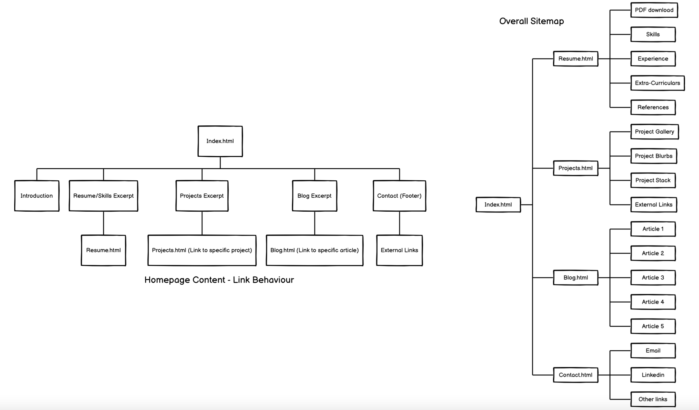
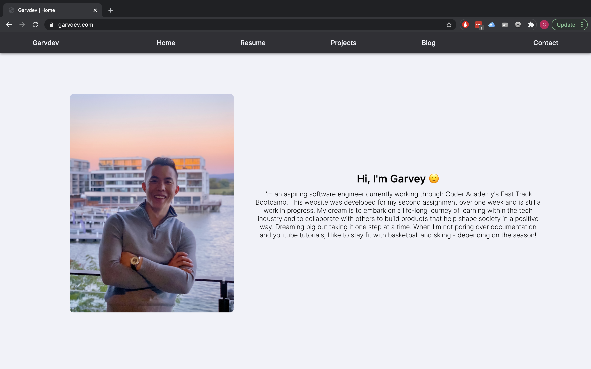
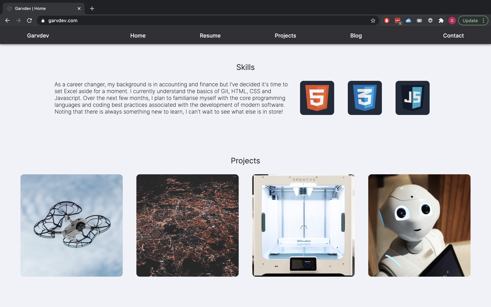
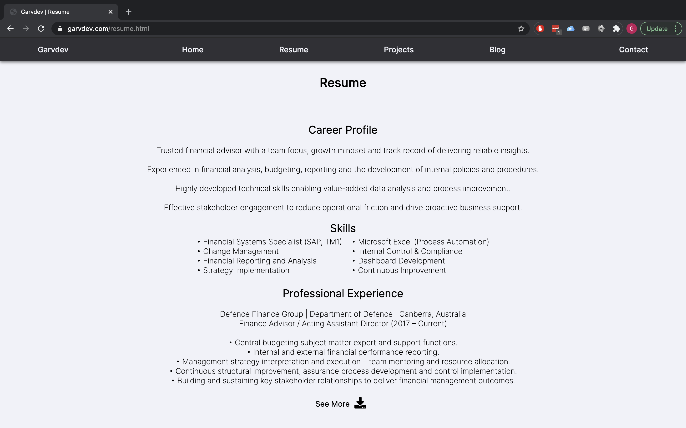
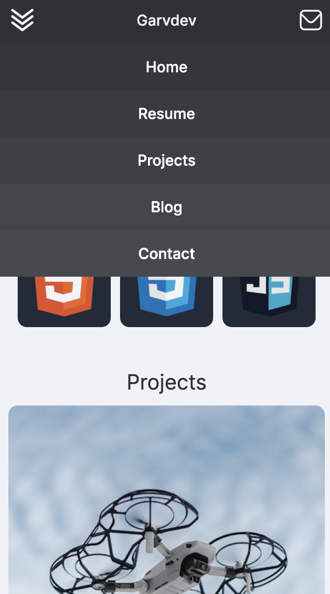
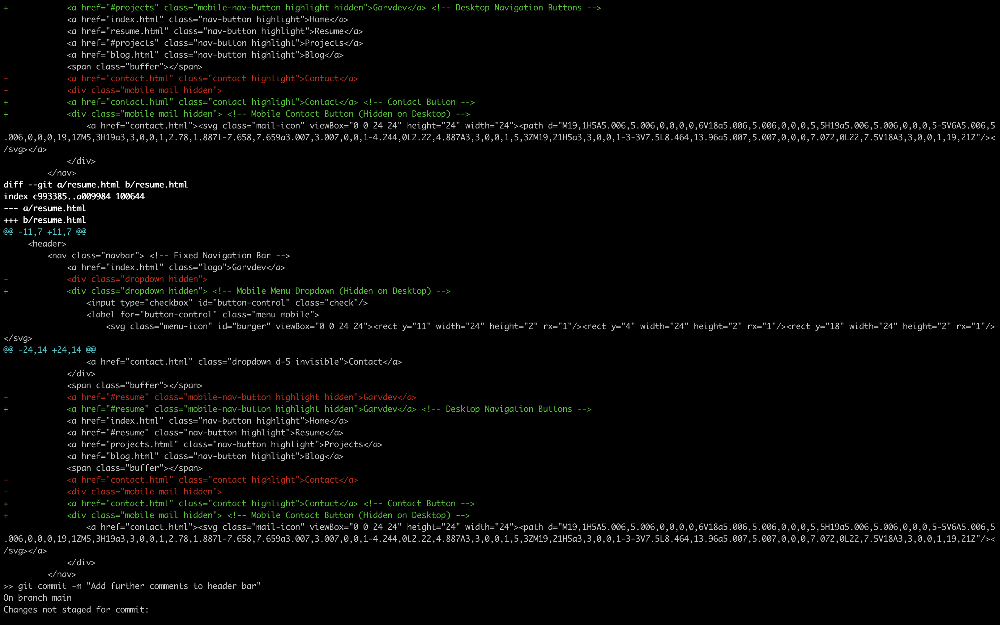
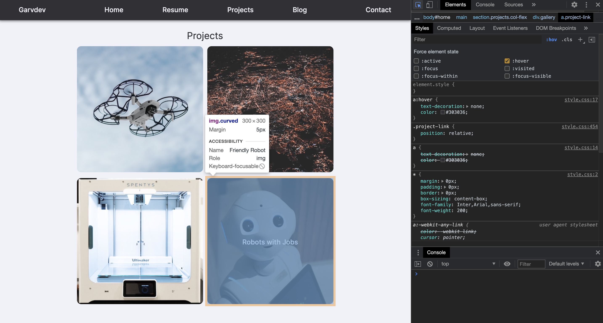

# T1A2 - Portfolio

### Coder Academy Sydney Fast-Track Bootcamp 2021

##### Garvey Chan

Website Link - https://garvdev.com

### Description / Purpose

This website was developed over Week 3 of the Coder Academy Fast-Track Bootcamp in 2021 for Term 1 Assignment 2 to showcase basic HTML/CSS abilities and serve as a practical learning experience for the theory covered in the program thus far.

While finished with respect to the requirements of the assignment, it is a perpetual work-in-progress as my skills and knowledge continue to develop.

Since the initial draft was presented halfway through Week 3, there have been several design changes to what was outlined in the slides, including but not limited to:
- Colour palette simplification;
- Element positioning tweaks;
- Removal/Addition/Modification of several components.

These change decisions were made due to time restrictions during implementation, diminishing returns on effort/reward, and further UI/UX considerations. Shunning JavaScript for this assignment was a self-imposed rule in order to force myself to seek out and explore the full potential of HTML/CSS to entrench my understanding of its capabilities.

There is also plenty of scope for **code refactoring**. This is because a bulk of the website was planned and built before I fully understand the complexities of responsive design elements and the interactions between box models and flexboxes. A lot of the final design tweaks have been applied as 'band-aid solutions' rather than refinement of the underlying styling roots. Given more time, I would rebuild the website from the ground up using **Grids**, develop better **cascading hiearchies** to align with more **structured HTML components**, implement better **naming conventions** and aim for a more modern 'flat' **aesthetic**.

### Functionality / Features

The website contains several key components styled around a common theme and utilised throughout each page.

##### Navigation Bar

##### Main Sections

*Articles/Figures - Image & Text*

*Pure Text (Split Paragraphs / Full Paragraphs)*

*Gallery*

##### Footer

### Sitemap

### Screenshots

||||
|:---:|:---:|:---:|
||||

### Target Audience

The target audience of this website is comprised of the wonderful educators at Coder Academy. Future iterations will serve to display my work, knowledge, and experience for potential recruiters. This repository will then be archived for historical and humorous purposes.

### Tech Stack

This website was written with HTML5 and CSS3 with the help of development tools including VSCode, Chrome Developer Tools, Github Version Control, and Trello. This website has been deployed via Github Pages with a custom domain from Namecheap.

